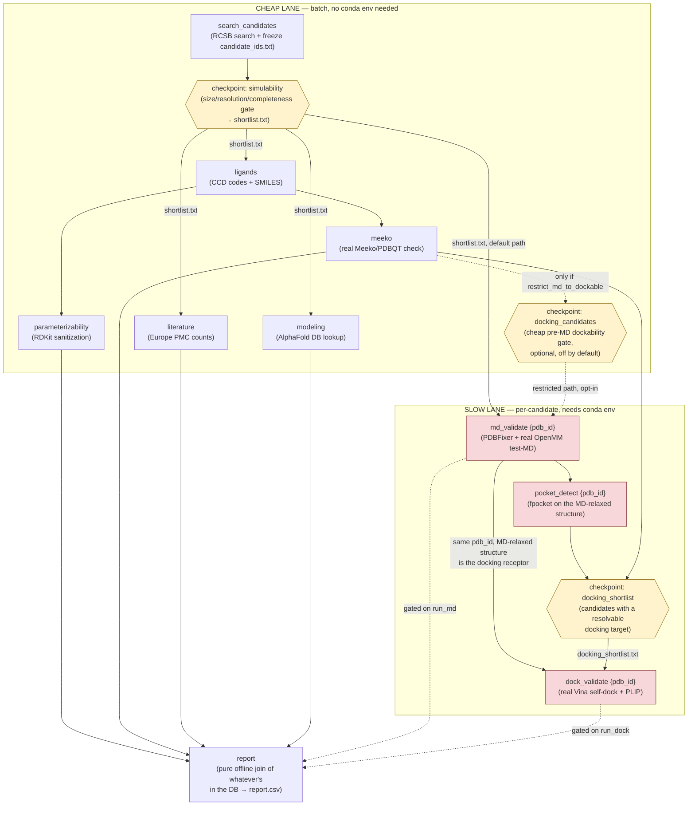

# How the Snakemake workflow works

This is the "orient yourself" doc for `Snakefile` — read this before reading the
Snakefile itself. For the full design history and *why* each decision was made, see
`PLAN.md` §15–§20 (this doc summarizes; PLAN.md is the source of truth).

## The big picture: two lanes feeding one report

The pipeline is split into a **cheap lane** (batch, network/CPU-light, no special
environment needed) and a **slow lane** (per-candidate, needs a conda env with
`openmm`/`pdbfixer`/`vina`/`plip`/`fpocket`/`obabel`). Both write into the same SQLite DB
(`cache/protein_selector.db`); a final `report` rule reads whatever is currently in the DB
and writes `results/report.csv`. Snakemake's job is purely to decide *what needs to run
and in what order* — the DB is the actual result store, not Snakemake itself.



Yellow = **checkpoints** (see below). Red = **slow-lane, per-candidate, conda-gated**
rules. Everything else is a plain batch rule in the cheap lane.

## Checkpoints vs. plain rules

Most rules are plain `rule`s: Snakemake can figure out their inputs/outputs from the
Snakefile alone, before running anything. Three rules — `simulability`,
`docking_candidates`, `docking_shortlist` — are `checkpoint`s instead, because their
*output determines the shape of later parts of the DAG*: you don't know which `{pdb_id}`
values `md_validate` needs to fan out over until `simulability` has actually run and
written `shortlist.txt`.

`_md_markers`/`_pocket_markers`/`_dock_markers` (plain Python functions in the Snakefile)
are the glue: each calls `checkpoints.<name>.get(**wildcards)`, which forces Snakemake to
actually execute that checkpoint first, then reads its real output file to build the list
of `results/md/{pdb_id}.done`-style targets. This all happens inside **one** `snakemake`
invocation — you never need to run the command twice to "discover" the shortlist and then
fan out over it.

## Why `md_validate`/`pocket_detect`/`dock_validate` are per-candidate, not batch

Every other slow-ish stage (`literature`, `modeling`, `parameterizability`, `meeko`) is a
single batch rule that loops over the whole shortlist internally. MD and docking are each
their own Snakemake **rule per `{pdb_id}`** instead, so that:

- Real parallelism: `--cores N` lets Snakemake run several candidates' MD/docking jobs
  concurrently, each respecting `threads: config["md_threads"]`/`dock_threads`.
- Real resume: if the run is killed partway through, already-`.done` candidates are not
  recomputed on the next invocation — only the ones missing a marker are.
- Real per-candidate failure isolation: one candidate's MD blowing up doesn't fail the
  whole batch the way an exception inside a single big loop would.

## The dependency chain that matters most: MD → pocket_detect → docking

As of PLAN.md §18, **docking doesn't fetch its own receptor** — it uses the exact
structure MD already validated as stable (`cache/md_structures/{pdb_id}_relaxed.pdb`).
That's why `pocket_detect {pdb_id}` and `dock_validate {pdb_id}` both directly depend on
`md_validate` for the *same* `pdb_id`: fpocket needs to run on the relaxed structure, and
the crystal ligand's real bound pose has to be superposed into that same coordinate frame
before Vina can use it (`molecular_dynamics/structure_alignment.py`).

**As of PLAN.md §20, `pocket_detect`'s output is informational only** — it no longer
defines the Vina search box or gates whether docking is attempted. The box now comes
directly from the aligned ligand's own coordinates (`docking/native_ligand.py`'s
`ligand_bounding_box`). fpocket still runs (useful for classroom discussion — "did blind
pocket detection also find the real site?") but a candidate can reach `dock_validate` and
succeed even if fpocket found nothing useful nearby.

## Markers vs. the database — and why `output:` usually isn't `touch()`

Most cheap-lane rules use `touch(str(STAGE_MARKER_DIR / "<stage>.done"))` — the marker's
only job is "tell Snakemake this ran," since the real result already lives in the SQLite
DB regardless.

`md_validate`/`pocket_detect`/`dock_validate` are different: their `output:` is **not**
wrapped in `touch()`. The `workflow/scripts/*.py` wrapper for each one creates the marker
file itself, and only when a real `ValidationResult` (or equivalent) was actually
persisted. If the conda env is genuinely missing `openmm`/`vina`/`fpocket`/etc., the
underlying `stages.*` function returns `None`, no marker gets created, and Snakemake
raises a loud `MissingOutputException` for that job. This is deliberate: an earlier
revision used `touch()` unconditionally, which meant a run with a broken/inactive conda
env would silently mark every candidate "done" — and a *later* run with a correctly
configured env would then skip them forever, since Snakemake saw the marker and assumed
nothing needed doing.

## Conda environment gating

`md_validate`, `pocket_detect`, and `dock_validate` each carry `conda:
config["validation_conda_prefix"]` — only those three rules (plus `report` transitively,
via their markers) need the heavy conda env with `openmm`/`pdbfixer`/`vina`/`plip`/
`fpocket`/`obabel`/`meeko`. Every other rule runs in the plain `uv`-managed base
environment. This means a plain cheap-lane-only invocation (`run_md=false
run_dock=false`) never needs a conda env at all — see `make workflow` in the `Makefile`.

## How to actually run it

```bash
# Cheap lane only — safe anywhere, no conda env needed
make workflow

# + MD slow lane (needs the conda env)
make workflow-md

# + MD + docking slow lanes (needs the conda env with the docking packages too)
make workflow-dock

# Everything, in one invocation
make workflow-all
```

Every target passes `--forcerun report` — Snakemake's default "is this output already
up to date" check doesn't reliably notice when `run_md`/`run_dock` flip between
invocations (a real, live-discovered gotcha, see `PLAN.md` §16/§17), so `report` is always
forced to re-evaluate what's actually in the DB.

**Gotcha worth knowing: re-running a candidate that already has a persisted result does
NOT recompute it.** `run_md_simulation_stage`/`run_docking_stage` both check the DB first
and return the cached row unless it was a specific, resolvable kind of failure
(`COMPLETENESS` — "the thing this depends on wasn't ready yet, is it ready now?"). Forcing
Snakemake to re-run the *rule* doesn't bypass this — the script still asks the DB first.
To force real recomputation (e.g., after a code fix like PLAN.md §20's box-derivation
change), delete the relevant rows from `validation` in the DB **and** the corresponding
`results/{md,pocket,dock}/{pdb_id}.done` marker files before re-running.

## Where to look next

- `PLAN.md` §15–§20 — the full decision history, including three real bugs found only by
  actually running this on a machine without the conda env (§15f), and the docking-box
  fix (§20).
- `Snakefile` itself — every rule's docstring cites the exact PLAN.md section it
  implements.
- `scripts/course_candidates.sql` — the query you actually run against the DB once this
  workflow has populated it, to pull a course-ready candidate shortlist.
